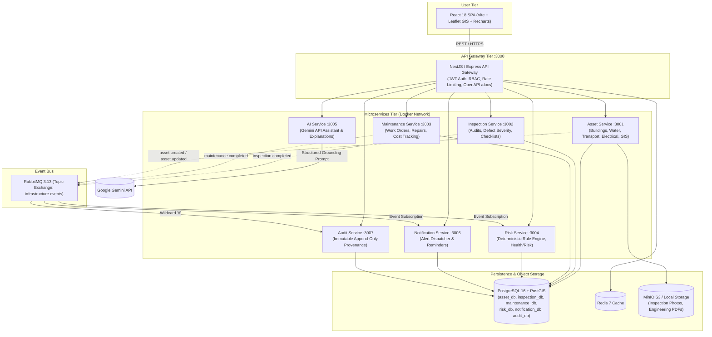

# InfraSphere
**Unified Infrastructure Asset Lifecycle & Intelligence Platform**

[](https://www.docker.com/)
[](https://postgis.net/)
[](https://www.rabbitmq.com/)
[](https://redis.io/)
[](https://ai.google.dev/)
[](https://www.typescriptlang.org/)
[](LICENSE)

---

## 1. Overview & Problem Statement

Public and enterprise infrastructure systems (hospitals, schools, high-voltage transformers, water treatment complexes, bridges, and municipal aqueducts) are traditionally managed in disparate, siloed databases or paper spreadsheets. This lack of unification leads to:
- **Blind Failures**: Failure to detect degraded assets before catastrophe strikes.
- **Hidden Dependencies**: Interruption of a power transformer unexpectedly cutting off water pumping stations and hospital emergency wards.
- **Untracked Lifecycles**: Missed warranty cutoffs, deferred preventive maintenance, and loss of institutional audit records.
- **Subjective Risk Calculations**: Arbitrary, manual risk scoring without deterministic formula-driven standardization.

**InfraSphere** solves this by providing a unified, production-oriented, full-stack infrastructure asset inventory and lifecycle intelligence platform. It tracks assets from initial planning and construction through active operation, scheduled inspection, automated deterministic risk recalculation, work order fulfillment, and decommissioning.

---

## 2. Architectural Highlights & Key Decisions

- **Domain-Modular Asset Service (NO Microservice Bloat)**: Instead of creating 10+ fragile microservices for every individual asset category (`building-service`, `water-service`, `road-service`, `bridge-service`, `transformer-service`), InfraSphere consolidates physical asset definitions into an extensible **Asset Service** structured with four high-performance domain sub-modules:
  - 🏢 **Buildings / Facilities**
  - 💧 **Water Infrastructure**
  - 🛣️ **Transport Infrastructure**
  - ⚡ **Electrical Infrastructure**
- **Deterministic Rule-Based Health & Risk Engine (NO Machine Learning)**: In mission-critical public infrastructure, life-safety risk scoring cannot rely on unpredictable, black-box ML models. InfraSphere calculates **Health Scores (0–100)** and **Risk Scores (0–100)** deterministically through weighted condition, age decay, defect severity deductions, and maintenance backlogs.
- **Grounded AI Intelligence Layer (Google Gemini)**: Gemini operates strictly as an intelligent query and explanation assistant. It **never** invents or overrides official risk scores. The AI receives verified system records and explains the mathematical rationale to engineers in plain English.
- **Strict Visual Design Language**: Built with crisp, modern, flat solid surfaces, high contrast, zero gradient overlays, and zero gratuitous CSS animations for optimal situational awareness.
- **Logical Database Isolation**: 6 dedicated databases (`asset_db`, `inspection_db`, `maintenance_db`, `risk_db`, `notification_db`, `audit_db`) running on PostgreSQL 16 with PostGIS spatial indexing.
- **Asynchronous Event-Driven Decoupling**: Uses RabbitMQ topic exchange `infrastructure.events` for domain event delivery with idempotent consumers.

---

## 3. System Architecture Diagram



---

## 4. Microservices Breakdown

| Service | Port | Database | Responsibilities | Key Published / Consumed Events |
| :--- | :--- | :--- | :--- | :--- |
| **API Gateway** | `3000` | Redis (Cache) | JWT verification, RBAC guard, Swagger `/docs`, reverse proxy, analytics aggregator | - |
| **Asset Service** | `3001` | `asset_db` | Asset lifecycle CRUD, 4 domain modules, GeoJSON coordinates, dependency topology | `asset.created`, `asset.updated`, `asset.deleted` |
| **Inspection Service** | `3002` | `inspection_db` | Field inspections, defect severity classification, finding resolution | Publishes: `inspection.completed` |
| **Maintenance Service** | `3003` | `maintenance_db`| Work order creation, technician assignment, repair logs, cost accounting | Publishes: `maintenance.completed`, `workorder.completed` |
| **Risk Service** | `3004` | `risk_db` | Deterministic health score & risk formula computation, matrix evaluation | Consumes: `inspection.completed`, `maintenance.completed` → Publishes: `risk.updated` |
| **AI Service** | `3005` | - | Grounded Gemini assistant, explaining risk calculations and impact cascades | Queries downstream services, calls Gemini API |
| **Notification Service**| `3006` | `notification_db`| Real-time alerts, critical defect warnings, upcoming inspection reminders | Consumes: `risk.updated`, `inspection.completed`, `workorder.completed` |
| **Audit Service** | `3007` | `audit_db` | Immutable compliance trail recording who, what, old/new states | Consumes: `#` (Wildcard capture of all events) |

---

## 5. Deterministic Health & Risk Scoring Rules (NO ML)

### Health Score Formula (0 to 100)
$$\text{HealthScore} = 0.35 \cdot S_{\text{condition}} + 0.20 \cdot S_{\text{age}} + 0.20 \cdot S_{\text{inspection}} + 0.25 \cdot S_{\text{maintenance}}$$

- **Condition Score ($S_{\text{condition}}$)**: EXCELLENT = 100, GOOD = 80, FAIR = 55, POOR = 30, CRITICAL = 10.
- **Age Score ($S_{\text{age}}$)**: Calculated by ratio $\text{Age} / \text{ExpectedLifeYears}$ ($<0.2 = 100$, up to $>1.3 = 10$).
- **Inspection Score ($S_{\text{inspection}}$)**: Base 100 minus severity deductions:
  - $\text{CRITICAL Defect} = -40$
  - $\text{HIGH Defect} = -25$
  - $\text{MEDIUM Defect} = -10$
  - $\text{LOW Defect} = -3$
- **Maintenance Score ($S_{\text{maintenance}}$)**: Base 90 minus active open work orders ($12\text{ pts each}$) and overdue penalties ($20\text{ pts if overdue } > 12\text{ months}$).

### Risk Score Formula (0 to 100)
$$\text{RiskScore} = \text{Normalize}\left(P_{\text{failure}} \times I_{\text{criticality}} \times M_{\text{multiplier}}\right)$$
- **Probability of Failure**: Inverse of Health Score: $(100 - \text{HealthScore}) + \text{DefectPenalty}$.
- **Criticality Impact Multipliers**:
  - `CRITICAL` = $1.6\times$
  - `HIGH` = $1.35\times$
  - `MEDIUM` = $1.15\times$
  - `LOW` = $1.0\times$

---

## 6. Pre-Configured Demo Credentials

The database comes pre-seeded with 5 role-based personas. Password for all accounts is: `Infrasphere@2026`.

| Role | Email | Name & Department | Permissions |
| :--- | :--- | :--- | :--- |
| **ADMIN** | `admin@infrasphere.local` | Chief Infrastructure Officer (Executive) | Full system administration, user provisioning, system overrides |
| **ASSET_MANAGER** | `asset.manager@infrasphere.local` | Rajesh Sharma (Asset Planning) | Asset CRUD, lifecycle transitions, dependency linkages |
| **INSPECTOR** | `inspector@infrasphere.local` | Pooja Verma (Field Safety & Quality) | Create inspections, log defect findings, complete audits |
| **MAINTENANCE_MANAGER**| `maintenance@infrasphere.local` | Amitabh Sen (Public Works Lead) | Create work orders, assign technicians, log repair completions |
| **VIEWER** | `viewer@infrasphere.local` | Ananya Roy (Public Oversight Observer)| Read-only exploration of dashboard, GIS map, and audit logs |

---

## 7. Realistic Seed Dataset (Mumbai / Maharashtra Infrastructure)

InfraSphere is pre-populated with **40 realistic infrastructure assets**, **16 dependency links**, **22 inspections**, **14 work orders**, and **22 audit trails**:

- **🏢 10 Buildings**:
  - `BLD-000001`: AIIMS Multi-Specialty Hospital Block A (10 Floors, RCC)
  - `BLD-000002`: Brihanmumbai Municipal Corporation HQ (Fort, CSMT)
  - `BLD-000003`: Dadar Central Disaster Management Bunker
  - `BLD-000004`: Thane Central General Civil Hospital
  - `BLD-000005`: Powai Innovation & Smart City Data Center
  - `BLD-000006` to `BLD-000010`: High schools, vaccine vaults, APMC food terminals, and regional fire stations.
- **💧 10 Water Assets**:
  - `WTR-000001`: Bhandup Primary Water Treatment Complex (2,800 MLD)
  - `WTR-000002`: Powai Lake Raw Water Pumping Station
  - `WTR-000003`: Malabar Hill Elevated Balancing Reservoir
  - `WTR-000004`: Vaitarna Trunk Transmission Water Aqueduct (3,000mm steel main)
  - `WTR-000005` to `WTR-000010`: Distribution sumps, storm outfalls, dam intake towers, and subsea interties.
- **🛣️ 10 Transport Assets**:
  - `TRN-000001`: Bandra-Worli Sea Link Main Cable-Stayed Bridge (8-lane)
  - `TRN-000002`: Eastern Express Highway Flyover (Vikhroli)
  - `TRN-000003`: Western Express Highway Andheri East Flyover
  - `TRN-000004`: Sion Railway Over Bridge (ROB) (Rocker bearing delamination)
  - `TRN-000005` to `TRN-000010`: SCLR double-decker flyover, expressway tunnels, smart boulevard grids, and coastal sea-walls.
- **⚡ 10 Electrical Assets**:
  - `ELC-000001`: **Powai 220kV/33kV Step-Down Distribution Transformer #2** *(Core Demo Flow Asset)*
  - `ELC-000002`: Bandra-Kurla Complex 33kV/11kV Gas-Insulated Substation
  - `ELC-000003`: Bhandup Water Treatment 33kV Dedicated Power Substation
  - `ELC-000004`: CSMT Underground Dry-Type Transformer Vault
  - `ELC-000005` to `ELC-000010`: 400kV grid interties, ring main units, emergency hospital DG backup arrays, and marine lighting substations.

---

## 8. Complete Step-by-Step Demo Flow

Follow this comprehensive walkthrough to demonstrate the full end-to-end capabilities of InfraSphere:

1. **Login & Dashboard**:
   - Navigate to `http://localhost:5173/login`.
   - Click the **Admin** 1-click login button (or enter `admin@infrasphere.local` / `Infrasphere@2026`).
   - Observe live dashboard statistics: Total Assets (40), Active Assets (38), Critical Assets (2), Open Work Orders, and flat-styled category/condition distribution bar charts.
2. **GIS Map & Spatial Filtering**:
   - Click **GIS Map** in the sidebar.
   - Filter by **Electrical** category and observe markers across Mumbai.
   - Click on the marker for **Powai 220kV Transformer** (`ELC-000001`).
   - Note the summary card on the right showing Health Score (84), Risk Score (25, Low/Medium), and location coordinates. Click **View Complete Asset**.
3. **Inspect Dependency Topology**:
   - On the asset details page, click the **Dependencies** tab.
   - Observe that `ELC-000001` supplies:
     - 🏢 `BLD-000005`: Powai Smart City Data Center
     - 💧 `WTR-000002`: Powai Lake Raw Water Pumping Station
     - 🏢 `BLD-000001`: AIIMS Multi-Specialty Hospital
   - Click **Run Failure Simulation** to see cascading infrastructure impact if this transformer fails.
4. **Conduct Inspection with Critical Defect**:
   - Switch role to **Inspector** (`inspector@infrasphere.local`).
   - In the asset page, click **Conduct Inspection**.
   - Set Condition to `POOR`, add finding *"Dielectric Oil Breakdown & Winding Insulation Rupture"*, severity `CRITICAL`.
   - Click **Complete Inspection & Publish Event**.
5. **Observe Event-Driven Recalculation**:
   - The Inspection Service publishes `inspection.completed` over RabbitMQ.
   - The **Risk Service** consumes the event and recalculates:
     - Inspection Score drops from 95 to 55.
     - Health Score drops to **38 (Poor)**.
     - Risk Score elevates to **78 (CRITICAL)**.
     - Maintenance Priority automatically shifts to **URGENT**.
   - The **Notification Service** delivers a real-time banner alert: *"CRITICAL DEFECT detected on Powai Transformer"*.
6. **Work Order & Maintenance Resolution**:
   - Switch role to **Maintenance Manager** (`maintenance@infrasphere.local`).
   - Click **Create Work Order** for `ELC-000001`: Title *"Emergency Oil Dehydration & High-Voltage Bushing Replacement"*, Priority `URGENT`.
   - After dispatch, click **Complete Work Order** with actual cost `₹380,000` and condition `GOOD`.
   - The Maintenance Service publishes `maintenance.completed`.
   - Risk recalculates back down to normal operating limits.
7. **Gemini AI Grounded Explanation**:
   - Open **AI Assistant** (`/ai-assistant`).
   - Prompt: *"Explain why the Powai Transformer was considered high risk and which facilities were impacted."*
   - Observe the response: Gemini cites exact database numbers (Health 38, Critical Defect, 220kV, AIIMS Hospital & Powai Pumping Station dependencies) while clarifying that risk was deterministically computed by the backend rule engine.
8. **Audit Trail Verification**:
   - Navigate to `/audit` to verify the tamper-proof ledger of every event (`inspection.completed`, `risk.updated`, `workorder.completed`) with timestamps and user provenance.

---

## 9. Running Locally

### Option A: Complete Docker Compose Stack
```bash
# 1. Clone repository
git clone https://github.com/your-org/infrasphere.git
cd infrasphere

# 2. Configure environment
cp .env.example .env

# 3. Start entire stack
docker compose up -d --build

# 4. Populate databases
node scripts/build_all_sql_seeds.js
Get-Content scripts\asset_db.sql | docker exec -i infrasphere-postgres psql -U infrasphere -d asset_db
Get-Content scripts\inspection_db.sql | docker exec -i infrasphere-postgres psql -U infrasphere -d inspection_db
Get-Content scripts\maintenance_db.sql | docker exec -i infrasphere-postgres psql -U infrasphere -d maintenance_db
Get-Content scripts\risk_db.sql | docker exec -i infrasphere-postgres psql -U infrasphere -d risk_db
Get-Content scripts\notification_db.sql | docker exec -i infrasphere-postgres psql -U infrasphere -d notification_db
Get-Content scripts\audit_db.sql | docker exec -i infrasphere-postgres psql -U infrasphere -d audit_db
```

### Option B: Local Node.js Development
1. Start core services:
```bash
docker compose up -d postgres redis rabbitmq
```
2. Build shared packages:
```bash
npm run build --workspace=@infrasphere/shared-types
npm run build --workspace=@infrasphere/shared-events
npm run build --workspace=@infrasphere/shared-utils
```
3. Run unit tests:
```bash
npx tsx --test packages/shared-utils/src/__tests__/risk.test.ts
```
4. Start API Gateway & Frontend:
```bash
npm run dev --workspace=@infrasphere/api-gateway
npm run dev --workspace=@infrasphere/frontend
```

---

## 10. Service Endpoints & Ports

| Endpoint | URL | Description |
| :--- | :--- | :--- |
| **Frontend Web App** | [http://localhost:5173](http://localhost:5173) | Single Page Application (Leaflet, Recharts, Personas) |
| **API Gateway** | [http://localhost:3000](http://localhost:3000) | Central REST Gateway & reverse proxy |
| **Swagger / OpenAPI** | [http://localhost:3000/docs](http://localhost:3000/docs) | Interactive API Explorer & schemas |
| **RabbitMQ Management** | [http://localhost:15672](http://localhost:15672) | Exchange `infrastructure.events` monitor (infrasphere / infrasphere_secret) |
| **PostgreSQL / PostGIS**| `localhost:5432` | 6 Logical databases (`asset_db`, etc.) |
| **Redis Cache** | `localhost:6379` | Dashboard caching & session store |
| **MinIO Storage** | `localhost:9000` / `9001` | S3-compatible document storage |

---

## 11. Security Implementation

- **Strict JWT RBAC**: Role-based access control evaluated at the gateway level (`ADMIN`, `ASSET_MANAGER`, `INSPECTOR`, `MAINTENANCE_MANAGER`, `VIEWER`).
- **Grounded AI (No Secret Leakage)**: `GEMINI_API_KEY` is maintained exclusively inside `ai-service` and never transmitted to the browser.
- **SQL Injection Immune**: All database access executes through parameterized queries and Prisma ORM.
- **File Upload Safeguards**: MIME-type validation, random UUID storage key generation, and directory path sanitization.

---

## 12. License
This project is licensed under the MIT License - see the [LICENSE](LICENSE) file for details.
