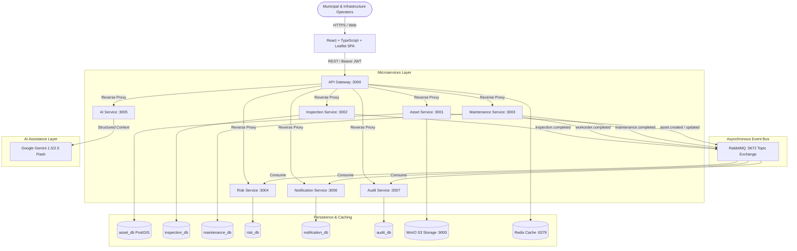

# InfraSphere Architecture Documentation

## 1. High-Level Architecture Overview

InfraSphere is an enterprise-grade Unified Infrastructure Asset Lifecycle & Intelligence Platform built on a distributed microservices pattern. It provides mission-critical tracking, GIS spatial mapping, deterministic risk and health evaluations, event-driven reactive updates, and AI assistance powered by Google Gemini.

## 2. Service Separation & Logical Domain Architecture

Instead of anti-pattern microservice sprawl (e.g., creating 15 microservices for every individual asset type), domain modules are unified inside the **Asset Service**:
- **Buildings & Facilities Module**: Hospitals, government secretariats, emergency bunkers, educational shelters
- **Water Infrastructure Module**: Treatment complexes, pumping stations, distribution reservoirs, aqueducts
- **Transport Infrastructure Module**: Cable-stayed bridges, elevated expressway viaducts, tunnels, smart street corridors
- **Electrical Infrastructure Module**: 220kV/33kV substations, power transformers, Ring Main Units, backup generators

## 3. Communication Patterns

1. **Synchronous (REST / JSON)**: Client-to-Gateway requests and Gateway-to-Service routing operate over low-latency HTTP REST.
2. **Asynchronous (RabbitMQ Topic Exchange)**: State modifications publish immutable domain events (`infrastructure.events`) ensuring decoupled eventual consistency.
   - Example: Completing an inspection with critical defects immediately publishes `inspection.completed`.
   - The **Risk Service** recalculates the deterministic Health Score and Risk Score.
   - The **Notification Service** registers real-time alerts.
   - The **Audit Service** writes an immutable provenance record.
