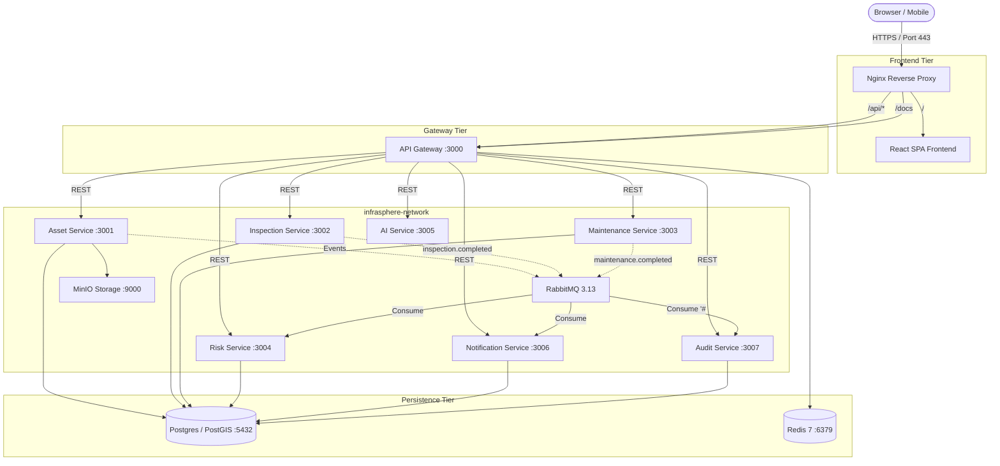

# InfraSphere Production Deployment Guide

This guide details the deployment architecture, configuration, and operational lifecycle for **InfraSphere** (Unified Infrastructure Asset Lifecycle & Intelligence Platform) in containerized environments (Docker Compose, Linux VPS, AWS EC2, and Kubernetes readiness).

---

## 1. Architecture Overview

In production, InfraSphere operates behind an **Nginx Reverse Proxy** terminating external web traffic and dispatching requests:
1. Static compiled frontend assets (Single Page React App) served through Nginx.
2. REST API traffic routed to the **API Gateway** (`:3000`).
3. Inter-service communications constrained entirely within the internal isolated Docker bridge network (`infrasphere-network`).
4. Asynchronous event distribution mediated by **RabbitMQ** topic exchange (`infrastructure.events`).
5. Object storage and document retention managed by **MinIO** S3-compatible service with persistent block volumes.
6. Persistent relational and spatial records isolated across 6 logical databases inside **PostgreSQL + PostGIS 16**.



---

## 2. Prerequisites & Server Sizing

### Minimum Host Requirements (Production VPS / AWS EC2)
- **Instance Type**: AWS `t3.xlarge` or DigitalOcean/Hetzner equivalent (4 vCPUs, 16 GB RAM).
- **Storage**: Minimum 80 GB SSD (NVMe recommended) with automated snapshot backups.
- **Operating System**: Ubuntu 22.04 LTS or Debian 12.
- **Installed Packages**:
  - Docker Engine v25+ (`docker-ce`, `docker-ce-cli`, `containerd.io`)
  - Docker Compose Plugin v2.24+

---

## 3. Environment Configuration

1. Clone the repository to the target deployment host:
```bash
git clone https://github.com/your-org/infrasphere.git /opt/infrasphere
cd /opt/infrasphere
```

2. Copy the production environment template:
```bash
cp .env.example .env
```

3. Configure secrets in `.env`:
```ini
NODE_ENV=production

# Database Credentials
POSTGRES_USER=infrasphere
POSTGRES_PASSWORD=your_strong_generated_password_here
POSTGRES_DB=infrasphere

# Authentication Secret (Generate with openssl rand -hex 32)
JWT_SECRET=b8d8f99e03d421cb83cf723bb0d91244e83c27e8d645e76d90e66b4455cfd891

# RabbitMQ Message Broker
RABBITMQ_USER=infrasphere
RABBITMQ_PASSWORD=your_rabbit_strong_password
RABBITMQ_HOST=rabbitmq
RABBITMQ_PORT=5672

# Redis Cache
REDIS_HOST=redis
REDIS_PORT=6379

# MinIO Object Storage
MINIO_ENDPOINT=minio
MINIO_PORT=9000
MINIO_ACCESS_KEY=your_minio_admin_key
MINIO_SECRET_KEY=your_minio_secret_key

# Google Gemini Intelligence Layer (Optional for AI Assistant)
GEMINI_API_KEY=AIzaSyYourActualGoogleGeminiApiKey
```

---

## 4. Persistent Volume Management

The following Docker volumes are configured with host persistence to guarantee zero data loss upon container lifecycle events:
- `infrasphere_postgres_data`: Houses all 6 database tablespaces, spatial indexes, and WAL logs.
- `infrasphere_rabbitmq_data`: Persists durable queues and unacknowledged messages.
- `infrasphere_redis_data`: Append-only file (AOF) persistence for caching layers.
- `infrasphere_minio_data`: Stores binary documents, photos, and inspection attachments.

### Backup Strategy
To trigger an automated backup of all 6 databases:
```bash
docker exec infrasphere-postgres pg_dumpall -U infrasphere > /opt/backups/infrasphere_$(date +%F_%T).sql
```

---

## 5. Starting the Production Stack

Execute the production Compose configuration:
```bash
docker compose -f docker-compose.prod.yml up -d --build
```

### Health Verification
Verify that all 11 core microservices and infrastructure components report `healthy` or `running`:
```bash
docker compose -f docker-compose.prod.yml ps
```

Run the automated health check script:
```bash
bash scripts/health-check.sh
```

---

## 6. SSL / TLS Termination with Let's Encrypt

On the host machine, install Certbot to obtain SSL certificates for your domain:
```bash
sudo apt-get install certbot python3-certbot-nginx -y
sudo certbot certonly --standalone -d infrasphere.yourdomain.com
```

Mount certificates into `/etc/nginx/ssl` inside `infrastructure/nginx/nginx.conf` and reload Nginx:
```bash
docker exec infrasphere-nginx nginx -s reload
```
