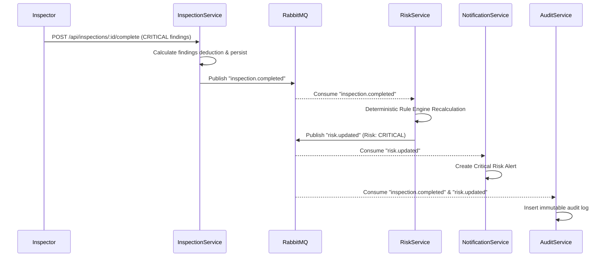

# InfraSphere RabbitMQ Event-Driven Architecture

## Exchange & Topology

- **Exchange**: `infrastructure.events`
- **Type**: `topic`
- **Durable**: `true`

## Routing Keys & Event Flow



## Idempotency Strategy

Every event includes an envelope:
```json
{
  "eventId": "c7a86f91-...",
  "eventType": "inspection.completed",
  "timestamp": "2026-03-28T07:15:00.000Z",
  "source": "inspection-service",
  "payload": { ... }
}
```
Consumers maintain an in-memory / Redis cache of processed `eventId`s. If an event is re-delivered by RabbitMQ, the consumer acknowledges immediately without re-executing side effects.
